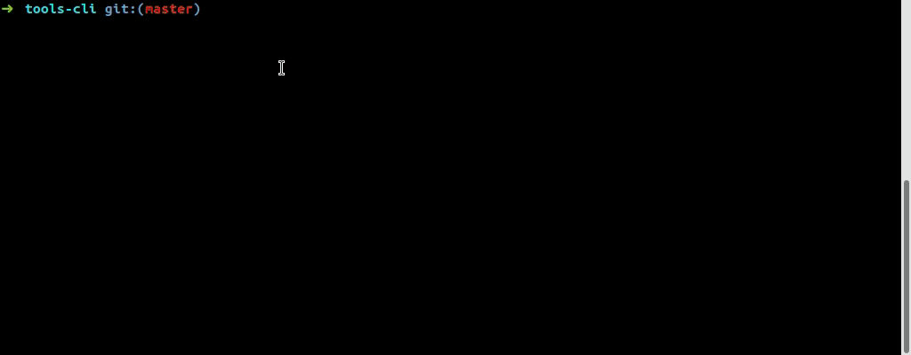

PHP-CLI SHELL for FIREWALL
-------------------

__New release will be only available on https://github.com/Renji-FR/PhpCliShell__

This repository is the addon for PHP-CLI SHELL about FIREWALL (acl) service.<br />
With this addon you can create ACLs (monosite, failover and fullmesh) and generate template for your firewall appliance.<br />
It is possible to upload ACLs config file to firewall with SCP. For SCP, you can use an SSH bastion.



For the moment, there are 3 templates:
* Juniper JunOS<br />
  __there are 2 templates for Juniper JunOS: one formated with {} and one with set commands__
* Cisco ASA<br />
  __there are 2 templates for Cisco ASA: one for the firewall itself and one for VPN DAP (Dynamic Access Policies)__
* Web HTML

ACL monosite:
* basic ACL, source(s), destination(s), no automation. For this ACL category you can not enable fullmesh option!

ACL failover:
* __without fullmesh option:__ failover ACL(s) will be automaticaly generated for all failover sites in inbound or outbound.
* __with fullmesh option:__ like without but source and destination of ACL will be isolated per zone to process automation.

You have to use base PHP-CLI SHELL project that is here: https://github.com/cloudwatt/php-cli-shell_base


INSTALLATION
-------------------

#### APT PHP
Ubuntu only, you can get last PHP version from this PPA:<br />
__*https://launchpad.net/~ondrej/+archive/ubuntu/php*__
* add-apt-repository ppa:ondrej/php
* apt update

You have to install a PHP version >= 7.1:
* apt install php7.3-cli php7.3-mbstring php7.3-readline pphp7.3-soap php7.3-curl

For MacOS users which use PHP 7.3, there is an issue with PCRE.
You have to add this configuration in your php.ini:
```ini
pcre.jit=0
```
*To locate your php.ini, use this command: php -i | grep "Configuration File"*


## USE PHAR

Download last PHAR release and its key from [releases](https://github.com/cloudwatt/php-cli-shell_firewall/releases)

Print console help:<br />
`$ php php-cli-shell.phar --help`

__*The PHAR contains all PHP-CLI SHELL components (Base, DCIM, IPAM and Firewall)*__

#### DEMO


Start FIREWALL demo with command:<br />
`$ php php-cli-shell.phar firewall:application:demo`

#### WIZARD


Create FIREWALL configuration with command:<br />
`$ php php-cli-shell.phar configuration:application:factory firewall`<br />
*For more informations about configuration file, see 'CONFIGURATION FILE' section*

Create FIREWALL launcher with command:<br />
`$ php php-cli-shell.phar launcher:application:factory firewall`


## USE SOURCE

#### REPOSITORIES
* git clone https://github.com/cloudwatt/php-cli-shell_base
* git checkout tags/v2.1.2
* git clone https://github.com/cloudwatt/php-cli-shell_firewall
* git checkout tags/v2.1.2
* Merge these two repositories

#### PHPIPAM (Optionnal)
If you have PHPIPAM and you want object name autocompletion, you have to perform these steps:
* git clone https://github.com/cloudwatt/php-cli-shell_phpipam
* git checkout tags/v2.1.2
* Merge this repository with two previous repositories (base and firewall)
* Install PHP-CLI SHELL for PHPIPAM with [README](https://github.com/cloudwatt/php-cli-shell_phpipam) helper

#### CONFIGURATION FILE
__[env] is not used by PHP-CLI, it is for user when he has many environments or sites to managed__
* mv configurations/firewall.envA.json.example configurations/firewall.[env].json
* vim configurations/firewall.[env].json
    * Adapt configuration to your network topology
    * Of course you can add more than two sites
    * Do not change topology attribute names: internet, onPremise, interSite, private
* Optionnal
    * You can create user configuration files for base and firewall services to overwrite some configurations<br />
      These files will be ignored for commits, so your user config files can not be overwrited by a futur release
    * mv configurations/firewall.envA.user.json.example configurations/firewall.[env].user.json
    * vim configurations/firewall.[env].user.json
      Change configuration like path or file
    * All \*.user.json files are ignored by .gitignore
* Juniper JunOS
    * In firewall.json, you can change the configuration push method:<br />
	```json
	"templates": {
		"juniper-junos_set": {
			"updateMode": "replace"
		}
	}
	```
    *Available modes: merge or replace*
* Cisco-ASA
    * Add this configuration in options section under sites to declare a global zone:<br />
	```json
	"options": {
		"globalZone": "global"
	}
	```

#### PHP LAUNCHER FILE
* mv firewall.php.example firewall.php
* vim firewall.php
    * Change [IPAM_SERVER_KEY] with the key of your PHPIPAM server in configuration file<br />
      You can add many PHPIPAM server, it is compatible multiple PHPIPAM<br />
      If you have not PHPIPAM service, remove argument or keep it empty<br />
__[env] is not used by PHP-CLI, it is for user when he has many environments or sites to managed__
* mv firewall.envA.php.example firewall.[env].php
* vim firewall.[env].php
    * Change [env] with the name of your environment


EXECUTION
-------------------

#### CREDENTIALS FILE
__*Change informations which are between []*__
* vim credentialsFile
    * read -sr USER_PASSWORD_INPUT
        * export SSH_SYS_LOGIN=[YourSystemLoginHere]
        * export SSH_NET_LOGIN=[YourNetworkLoginHere]
        * export SSH_NET_PASSWORD=$USER_PASSWORD_INPUT<br />
        __Bastion authentication must be base on certificate__

        __PHPIPAM__ (Only if you use PHPIPAM service/addon)
        /!\ For security reason, use a read only account!
        * export IPAM_[IPAM_SERVER_KEY]_LOGIN=[YourLoginHere]
    * export IPAM_[IPAM_SERVER_KEY]_PASSWORD=$USER_PASSWORD_INPUT<br />
        __Change [IPAM_SERVER_KEY] with the key of your PHPIPAM server in configuration file__

#### SHELL
Launch PHP-CLI Shell for FIREWALL service
* source credentialsFile
* php firewall.[env].php
